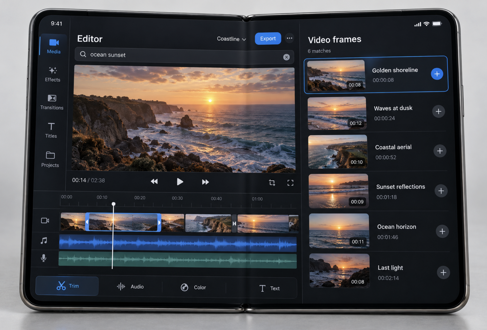

<p align="center">
  
</p>

<h1 align="center">VModalSDK for Apple platforms</h1>

<p align="center">
  Search, upload, and index video with one concurrency-safe Swift package.<br>
  Built for iOS, macOS, and SwiftUI with Xcode 26.6.
</p>

<p align="center">
  
  
  
  
  
</p>

VModal SDK 1.2.2 gives Apple apps an async, strongly typed API for the full
video search lifecycle. It uses Swift structured concurrency, supports safe
credential rotation, streams upload progress, and keeps collection/stream
scope immutable so related operations cannot drift apart.

## Quick start

### 1. Authenticate

Add `https://github.com/v-modal/vmodal_sdk_swift_iphoneduo` in Xcode through
**File → Add Package Dependencies**, then attach the `VModalSDK` product to
your app target.

Gateway mode is the standard application configuration. The provider is read
before every request, so a rotated credential takes effect immediately without
rebuilding the client.

```swift
import VModalSDK

let keys = try MutableAPIKeyProvider("your-bearer-token")
let project = try VModal.configure(
    projectID: "demo",
    apiKeyProvider: keys
)
```

Environment bootstrap accepts `VMODAL_API_KEY`, derives the gateway URL from
`VMODAL_ENV`, and resolves identity through `auth/me` when necessary:

```swift
let client = try await VModalClient.fromEnvironment(
    ProcessInfo.processInfo.environment
)
```

Never log configuration values, providers, authorization headers, signed URLs,
or server error bodies. Direct mode is deliberately named `unsafeDirect` and
requires an explicit backend identity.

### 2. List collections

```swift
let names = try await project.listCollections()
```

Create one immutable scope and reuse it. Upload, search, and indexing will then
share exactly the same backend collection and stream mapping.

```swift
let videos = try project.scope(
    collectionName: "field-notes",
    streamName: "camera-a"
)
```

### 3. List index jobs

```swift
let jobs = try await videos.listIndexJobs()
```

## Upload. Index. Find the moment.

Uploads start immediately and expose a coalesced `AsyncStream` of progress.
File content is replayable when a retry is safe, while gateway credentials are
never attached to the signed upload destination.

```swift
let source = try UploadSource(fileURL: movieURL)
let upload = videos.upload(source)

Task {
    for await update in upload.progress {
        print("uploaded \(update.percent)%")
    }
}

let uploaded = try await upload.result
let matches = try await videos.search("red delivery van")
```

| Capability | SDK behavior |
|---|---|
| Authentication | Bearer-token gateway mode with runtime rotation |
| Collections | Project-level discovery and immutable scoped operations |
| Uploads | Replayable file sources, progress streams, and signed destinations |
| Search | Async scoped video and frame search |
| Indexing | Create, inspect, list, and cancel jobs |
| Reliability | Typed failures, retry policy, cancellation, and idempotent close |

Cancel one operation without poisoning unrelated requests:

```swift
let cancellation = CancellationToken()
let work = Task {
    try await videos.search("loading dock", cancellation: cancellation)
}

await cancellation.cancel()
_ = try? await work.value
```

Rotate or revoke credentials explicitly:

```swift
try await keys.rotate("replacement-token")
await keys.clear()
```

The project owns its client. Close it once when the owning scene or session
ends. `close()` is idempotent and closes control and signed-upload transports.

```swift
await project.close()
```

## Designed for SwiftUI

`Examples/StarterIOS` keeps one `@MainActor` session owner, places work in
cancelable tasks, and uses an adaptive `NavigationSplitView`. Upload ownership
is separate from view geometry, so ordinary scene resizing does not recreate
an operation.

```swift
@main
struct StarterIOSApp: App {
    @State private var session = AppSession()

    var body: some Scene {
        WindowGroup {
            ContentView()
                .environment(session)
        }
    }
}
```

The iPhone Duo/Xcode 27.1 acceptance work is preserved as commented future code.
See the [feature and restoration guide](docs/iphone_duo.md) and the
[deferred acceptance matrix](docs/iphone_duo_acceptance.md).

<!-- FUTURE_IPHONE_DUO_XCODE_27_1
Restore explicit folded/unfolded, Split View, multi-scene, cancellation, and
upload-continuity claims after the exact iPhone Duo simulator gate is restored.
-->

## Reference and package layout

- [Complete operation parity reference](Sources/VModalSDK/VModalSDK.docc/APIReference.md)
- [Public Swift package repository](https://github.com/v-modal/vmodal_sdk_swift_iphoneduo)
- `Sources/VModalSDK` — client, resources, models, uploads, and transport
- `Examples/StarterIOS` — adaptive SwiftUI starter application
- `Tools` — route sync, release manifest, simulations, and live checks

## Verify locally

```bash
bash install.sh check
bash cli.sh routes_check
bash build.sh analyze
bash test.sh test
bash test.sh sim
bash test.sh ios
bash security_check.sh all
```

Live calls are opt-in. Source the repository test environment and run
`bash test.sh live` or `bash test.sh cctv_live`. Offline tests never require a
credential. `env.sh` derives `VMODAL_LIVE_FILE` and `VMODAL_CCTV_FILE` from the
checked-in Flutter video fixture in this monorepo; public-package users set
those paths explicitly.

Multipart upload remains experimental and opt-in. Disabled endpoints throw
`FeatureDisabledError` locally before making a network request.

## License

VModalSDK is available under the [MIT License](LICENSE).
